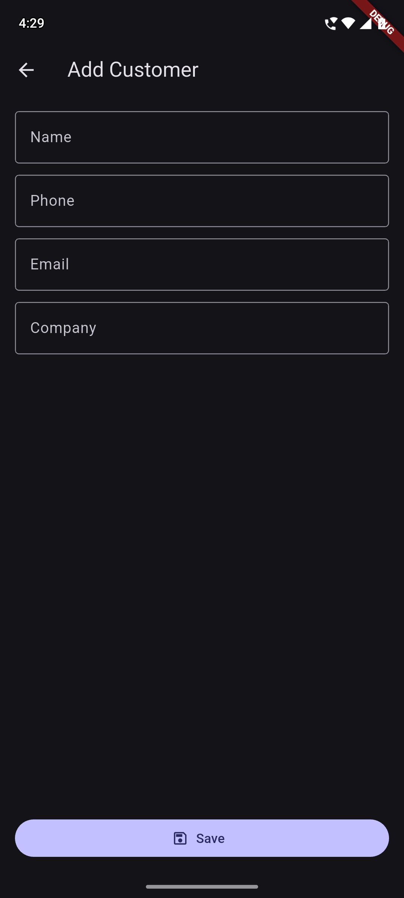
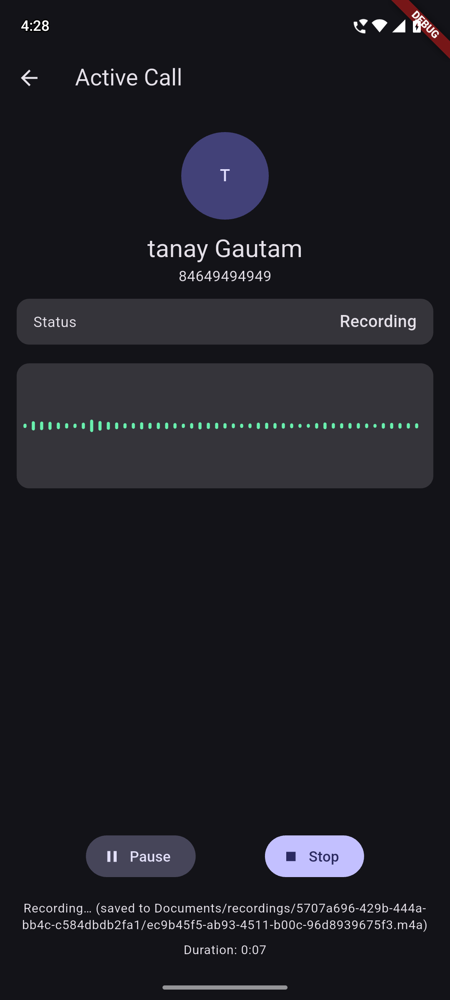
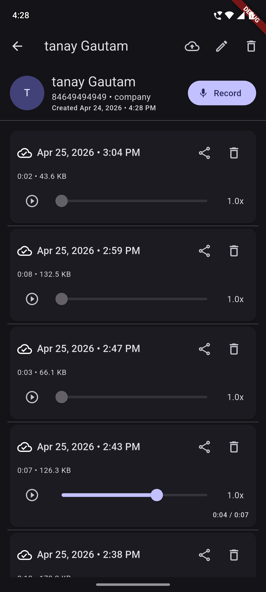
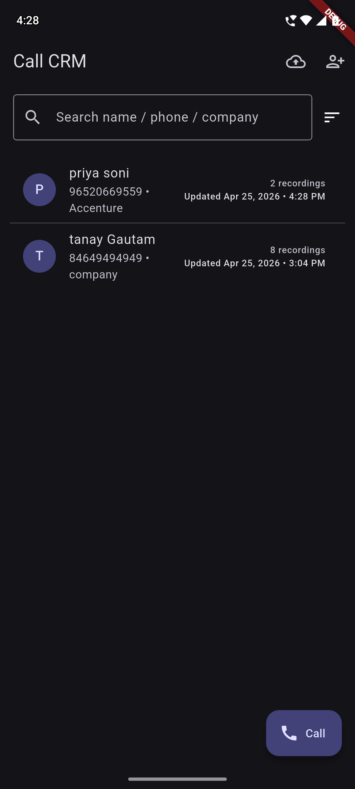
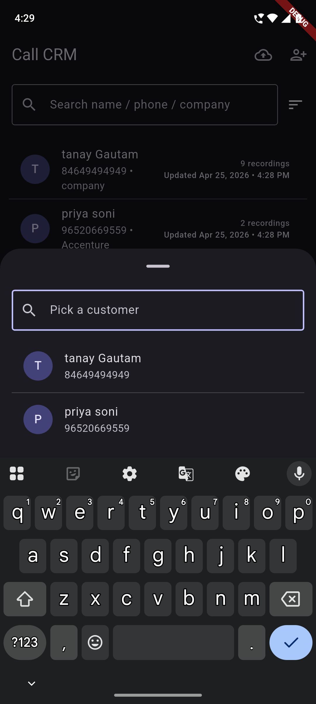

# Call CRM App

Production-ready **Call Recording + Basic CRM** built with Flutter + Riverpod + Hive.

## What’s implemented

1) **CRM (Customer Management)**
- Full CRUD: name, phone, email, company, optional avatar field (metadata)
- Search by name/phone/company
- Sorting: **last called**, **most recorded**, **newest**
- Delete customer with **cascade deletion** of their recordings (Hive + files)
- Customer detail screen shows **call history list**

2) **Call Recording**
- “Active call” screen (simulated call UI)
- Record with **live waveform** (`audio_waveforms`)
- Pause/resume, stop
- Auto-save to local storage (AAC in `.m4a`)
- Playback: play/pause/seek + speed (0.5x/1x/1.5x/2x)
- Show duration, size, recorded date
- Delete from UI (also deletes audio file)
- Export/share via platform share sheet (`share_plus`)


## 📱 Screenshots

<div align="center">
  <table>
    <tr>
      <td align="center">
        
        <br/>
        <b>Add Customer Page</b>
      </td>
      <td align="center">
        
        <br/>
        <b>Call Recording View</b>
      </td>
      <td align="center">
        
        <br/>
        <b>Customer Detail</b>
      </td>
      <td align="center">
        
        <br/>
        <b>Home View</b>
      </td>
       <td align="center">
        
        <br/>
        <b>Search Customer</b>
      </td>
    </tr>
  </table>
</div>


## Setup

Prereqs:
- Flutter `3.38+` (this repo is tested with Flutter `3.38.7`, Dart `3.10.7`)
- Android Studio / Xcode set up for your machine

1. Clone the repository
```bash
git clone https://github.com/Tanay610/call-crm-flutter.git
```


Installation:
```bash
flutter clean
flutter pub get
dart run build_runner build --delete-conflicting-outputs
flutter test
flutter run
```

### Build APK
```bash
flutter build apk --release
```

### APK Download
- Drive: [Download APK](https://drive.google.com/file/d/1diZYOOirrh8_Ya-OYjUCwiwtf4GWLhYP/view?usp=sharing)


Submission checklist helper:
```bash
chmod +x tool/submission_check.sh
./tool/submission_check.sh
```


## Architecture (Clean Architecture)

Folder layout:
```
lib/
  core/            # theme, constants, DI, utils
  data/            # Hive models/datasources, file storage, mock remote API
  domain/          # entities, repository interfaces, usecases
  presentation/    # Riverpod providers, pages, widgets
```

ASCII diagram:
```
presentation  --->  domain  <---  data
   |                 |             |
   |           usecases/interfaces |
   |                 |             |
   +---- Riverpod ----+     Hive + FS + Dio(Mock)
```

Why Riverpod:
- Simple, testable DI + state; async loading/error states are first-class (`AsyncValue`)
- Great fit for “local-first” apps with multiple independent controllers (customers, recordings, audio)

## Local Storage

Metadata: **Hive**
- Customers: `id, name, phone, email, company, createdAt, updatedAt`
- Recordings: `id, customerId, filePath, duration, size, recordedAt, synced`

Audio files: **File system**
- Path: `Documents/recordings/{customerId}/{recordingId}.m4a`

## Permissions

Runtime permissions (handled with rationale + retry/settings redirect):
- Microphone (`RECORD_AUDIO` / `NSMicrophoneUsageDescription`)
- Storage (Android; recordings are saved locally)

## Mock API (local-first sync)

Domain contract: `lib/domain/repositories/recording_api.dart`
- `uploadRecording(File file)`
- `syncRecordings()`

Fake implementation: `lib/data/remote/mock_recording_api.dart`
- Simulates **2s** delay
- **10% random failure** (to validate retry/error UX)

Retrofit contract (for swapping to a real backend later): `lib/data/remote/recording_api_client.dart`
- Uses `dio + retrofit` annotations
- Current repo uses the mock API for behavior; swap by providing a real `RecordingApi` implementation in `lib/core/di/providers.dart`

## Tests

Passing tests (run with `flutter test`):
- Use case: `test/domain/add_customer_test.dart`
- Use case: `test/domain/delete_customer_test.dart`
- Provider/controller: `test/presentation/customers_controller_test.dart`


## 📄 License

This project is licensed under the MIT License - see the LICENSE file for details.

## 👨‍💻 Author

**Tanay Gautam**

- GitHub: @Tanay610
- LinkedIn: [Tanay Gautam](https://linkedin.com/in/tanaygautam)

## 🙏 Acknowledgments

- Flutter team for amazing framework
- Riverpod for excellent state management
- Hive for fast local storage
- Open source community

---


<div align="center"> 
  <b>Built with ❤️ using Flutter</b> <br/> 
  <sub>Assessment Project - Call CRM App</sub> 
</div>

